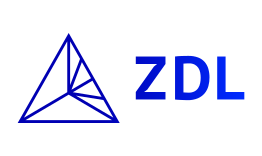
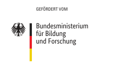

# QS

*QS* ist die Qualitätssicherungs-App von *Wortgeschichte digital* ([WGd](https://adw-goe.de/forschung/weitere-forschungsprojekte/wortgeschichte-digital-teilprojekt-im-zdl/)), dem an der *Niedersächsischen Akademie der Wissenschaften zu Göttingen* ([NAWG](https://adw-goe.de/)) angesiedelten Teilprojekt des *Zentrums für digitale Lexikographie der deutschen Sprache* ([ZDL](https://www.zdl.org/)). WGd und das ZDL werden gefördert vom *Bundesministerium für Bildung und Forschung* ([BMBF](https://www.bmbf.de/)).

Die im Projekt *Wortgeschichte digital* verfassten Wortgeschichten werden auf der Homepage des ZDL publiziert: <a href="https://wortgeschichten.zdl.org/">wortgeschichten.zdl.org</a>.

<a href="https://adw-goe.de/"></a><a href="https://www.zdl.org/"></a><a href="https://www.bmbf.de/"></a>

## Inhalt
* [Zur App](#zur-app)
* [Bauanleitung](#bauanleitung)
* [Lizenzen](#lizenzen)
* [Kontakt](#kontakt)

## Zur App

Die App dient zur formalen Qualitätssicherung der mithilfe von *[Zettel’s Traum](https://github.com/WortgeschichteDigital/ZettelsTraum)*, der Wortkartei-App von *Wortgeschichte digital*, erstellten XML-Dateien. Sie ist sehr spezifisch auf die Bedürfnisse des Projekts und auf das intern genutzte XML-Format zugeschnitten.

## Bauanleitung

*QS* ist eine [Electron](https://electronjs.org/)-App. Man kann sie leicht für die Betriebssysteme Windows, macOS und Linux paketieren. Kurzanleitung:

Repository klonen:

```
$ git clone https://github.com/WortgeschichteDigital/QS.git QS
```

Oder den Tarball herunterladen, in dem sich mit jedem neuen [Release](https://github.com/WortgeschichteDigital/QS/releases) ein Snapshot des Quellcodes findet: `QS_1.0.0.tar.gz`.

```
$ tar -xzf QS_1.0.0.tar.gz
```

Node.js installieren:

```
$ sudo apt-get install nodejs
```

Electron installieren:

```
$ cd QS
$ npm install --save-dev electron
```

Starten der App:

```
$ npm start
```

Electron-Builder und Electron-Packager installieren:

```
$ npm install --save-dev electron-builder
$ npm install --save-dev electron-packager
```

Paketieren:

```
$ node build/build.mjs [win32|linux|darwin]
```

Hilfe:

```
$ node build/build.mjs --help
```

## Lizenzen

Alle Eigenentwicklungen von *QS* stehen unter der [GNU General Public License v3.0](https://www.gnu.org/licenses/gpl-3.0.en.html).

Die Icons stammen zum größten Teil aus dem *[Papirus Icon Theme](https://github.com/PapirusDevelopmentTeam/papirus-icon-theme)*, das ebenfals unter [GNU General Public License v3.0](https://www.gnu.org/licenses/gpl-3.0.en.html) lizenziert wurde. Die Original-Icons wurden alle leicht verändert. Daneben gibt es eigens für *QS* erstellte Icons, die unter derselben Lizenz stehen.

Die mitgelieferten *[Noto Fonts](https://www.google.com/get/noto/)* stehen unter der [SIL Open Font License v1.1](https://scripts.sil.org/cms/scripts/page.php?id=OFL).

## Kontakt

[Nico Dorn](https://adw-goe.de/forschung/weitere-forschungsprojekte/wortgeschichte-digital-teilprojekt-im-zdl/mitarbeiterinnen-und-mitarbeiter/nico-dorn/), Niedersächsische Akademie der Wissenschaften zu Göttingen
